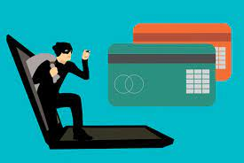

# Credit Card Fraud Detection



<a href="https://www.kaggle.com/mlg-ulb/creditcardfraud">Download Dataset Here</a>

``` Any transaction made by the credit card should be monitored to make decision that it's normal or fraud. So we will be doing anomly detection to go with them.```
